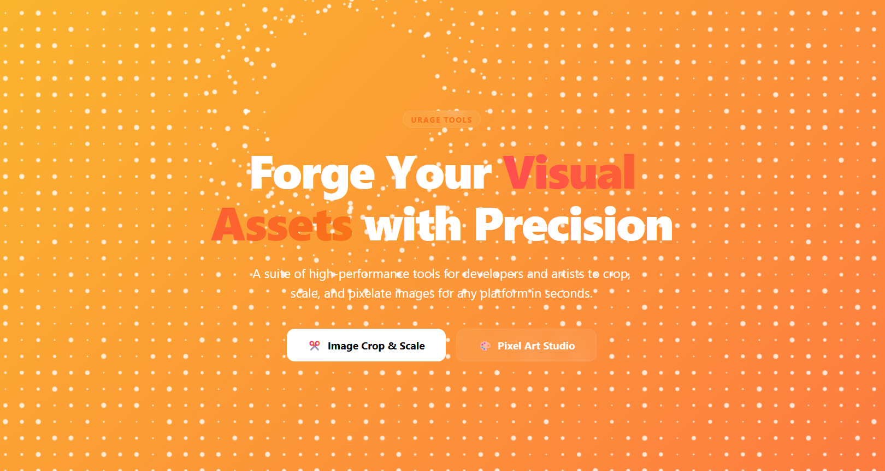

# URageTools

A collection of fast, free, and privacy-focused web tools for developers and creators. All tools run directly in your browser with no server dependencies.

## Tools Overview

### Audio & Sound Lab
- **SFX Generator** - Create custom sound effects with waveforms, parameters, and presets
- **Audio Visualizer** - Visualize audio in real-time with various display modes

### Art & Design
- **Image Crop & Scale** - Crop and scale images for different platforms with automatic dimension calculation
- **Pixel Art Studio** - Create and edit pixel art with grid support and color palette management
- **Seamless Texture Maker** - Generate seamless textures for 3D applications and games
- **Color Palette Extractor** - Extract color palettes from images
- **Color Swapper** - Swap colors in images with various blending modes
- **Image Transparency Tool** - Remove or add transparency to images
- **SVG Editor** - Edit and create SVG graphics with vector tools
- **3D Model Viewer** - View and rotate 3D models in your browser
- **Image to SVG Converter** - Convert raster images to vector SVG graphics
- **Image Split & Combine** - Split images into grids or combine multiple images
- **Favicon Creator** - Create favicons from images
- **Pixel Art Converter** - Convert images to pixel art style
- **Image Transparency Tool** - Remove or add transparency to images

### Developer Utilities
- **CSS Background Generator** - Generate CSS background patterns and gradients
- **HTML Separator and Combiner** - Split and combine HTML files
- **Markdown Multi-Tool** - Convert between markdown formats and other text formats
- **QR Code Creator** - Generate QR codes from text
- **Website Builder** - Build simple websites with drag-and-drop interface
- **Wave Animation** - Create animated wave effects for web pages
- **Readme File Viewer** - View and edit README files

### Planning Tools
- **Game Idea Generator** - Generate creative game ideas and concepts
- **Roadmap Builder** - Create project roadmaps and timelines

## Features

- **Privacy Focused**: All processing happens in your browser - no data is sent to servers
- **No Registration Required**: Use all tools immediately without creating an account
- **Fast and Lightweight**: Optimized for performance with minimal resource usage
- **Cross-Platform**: Works on desktop, tablet, and mobile devices
- **Modern UI**: Clean, intuitive interface with dark/light theme support
- **Responsive Design**: Adapts to any screen size

## Browser Requirements

All tools require a modern browser with support for:
- Web Audio API (for audio tools)
- Canvas API (for visualizations)
- Modern JavaScript features
- Local Storage (for saving presets)

## Contributing

We welcome contributions to improve URageTools! Please follow these steps:

1. Fork the repository
2. Create a feature branch
3. Make your changes
4. Submit a pull request

## License

MIT License

Copyright (c) 2026 URageTools

Permission is hereby granted, free of charge, to any person obtaining a copy
of this software and associated documentation files (the "Software"), to deal
in the Software without restriction, including without limitation the rights
to use, copy, modify, merge, publish, distribute, sublicense, and/or sell
copies of the Software, and to permit persons to whom the Software is
furnished to do so, subject to the following conditions:

The above copyright notice and this permission notice shall be included in all
copies or substantial portions of the Software.

THE SOFTWARE IS PROVIDED "AS IS", WITHOUT WARRANTY OF ANY KIND, EXPRESS OR
IMPLIED, INCLUDING BUT NOT LIMITED TO THE WARRANTIES OF MERCHANTABILITY,
FITNESS FOR A PARTICULAR PURPOSE AND NONINFRINGEMENT. IN NO EVENT SHALL THE
AUTHORS OR COPYRIGHT HOLDERS BE LIABLE FOR ANY CLAIM, DAMAGES OR OTHER
LIABILITY, WHETHER IN AN ACTION OF CONTRACT, TORT OR OTHERWISE, ARISING FROM,
OUT OF OR IN CONNECTION WITH THE SOFTWARE OR THE USE OR OTHER DEALINGS IN THE
SOFTWARE.

## Author

URageTools - A collection of creative web tools for developers and designers
