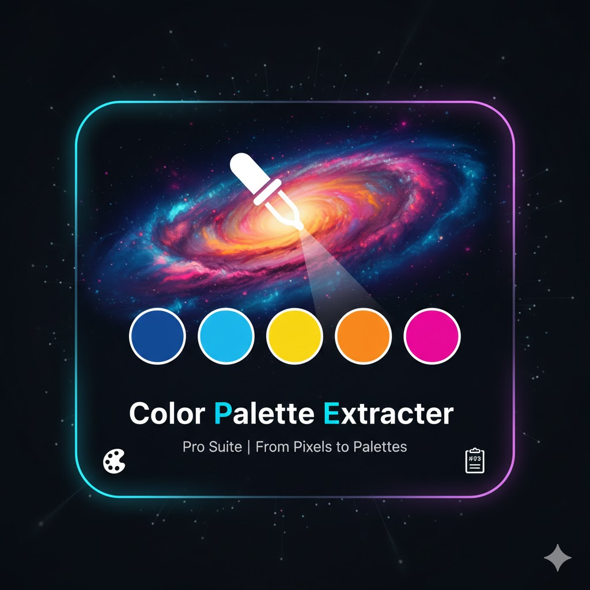

# Color Palette Extractor

A powerful tool for extracting color palettes from images with accessibility analysis and WCAG compliance checking.

## Description

The Color Palette Extractor is a web-based tool that analyzes images and extracts dominant colors to create professional color palettes. It provides detailed accessibility analysis using WCAG standards, allowing designers and developers to ensure their color choices meet accessibility requirements. The tool also supports exporting color palettes as texture maps for use in design and development projects.

## Features

- **Image Analysis**: Extract dominant colors from any image file
- **Palette Customization**: Adjust the number of colors (4-64 swatches)
- **Sorting Options**: Sort colors by popularity or luminance
- **Layout Views**: Switch between grid and strip views for color palettes
- **Accessibility Hub**: Real-time WCAG contrast analysis for color combinations
- **History Tracking**: Save and revisit previous palette analyses
- **Texture Export**: Download color palettes as PNG texture maps
- **Theme Support**: Light and dark mode toggle
- **Responsive Design**: Works on all device sizes

## How to Use

1. **Upload an Image**: 
   - Click on the drop zone or drag and drop an image file
   - Supported formats: JPG, PNG, GIF, WebP

2. **Customize Palette**:
   - Adjust the number of swatches using the slider (4-64 colors)
   - Choose sorting method (Popularity or Luminance)
   - Select layout view (Grid or Strip)

3. **Analyze Colors**:
   - View extracted color palette
   - Check accessibility contrast ratios in the Accessibility Hub
   - Review history of previous analyses

4. **Export Results**:
   - Download the color palette as a PNG texture map
   - Revisit previous analyses from the History Log

## Technical Details

### How It Works

The tool uses HTML5 Canvas API to analyze image pixels and extract color information:

1. **Pixel Analysis**: Reads image data using `getImageData()`
2. **Color Clustering**: Groups similar colors to reduce redundancy
3. **Color Distance Calculation**: Uses Euclidean distance to ensure color diversity
4. **Accessibility Analysis**: Calculates WCAG contrast ratios for color combinations
5. **Performance Optimization**: Dynamically adjusts sampling rate based on image size

### Browser Compatibility

- Chrome 60+
- Firefox 55+
- Safari 10+
- Edge 16+
- Mobile browsers (iOS Safari, Android Chrome)

### Dependencies

- Pure JavaScript (no external libraries)
- HTML5 Canvas API
- LocalStorage for history tracking

## Accessibility Features

The tool includes a comprehensive accessibility analysis hub that:

- Calculates WCAG 2.1 contrast ratios
- Identifies color combinations that meet AA and AAA standards
- Provides visual feedback for accessibility compliance
- Displays pass/fail indicators for each color combination

## License

This project is licensed under the MIT License - see the [LICENSE](../LICENSE) file for details.

## Author

URageTools - A collection of web-based design and development utilities

For more information about this tool or other utilities in the URageTools collection, visit the [main repository](../README.md).

## Support

If you encounter any issues or have suggestions for improvements, please open an issue on the GitHub repository.