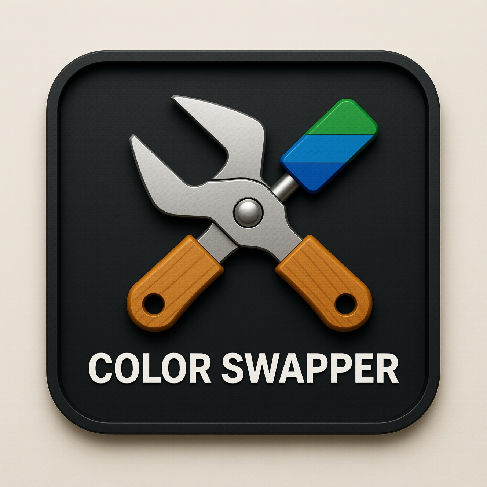

# Color Swapper Tool

A powerful web-based tool for swapping and modifying colors in images. This tool allows you to select colors from an image and swap them with new colors, as well as apply hardware-style color palettes to your images.

## Features

- **Color Selection**: Click on any pixel in an image to select its color
- **Color Swapping**: Replace selected colors with new colors using a color picker
- **Hardware Presets**: Apply classic color palettes from retro gaming systems:
  - GameBoy DMG (Original Green)
  - GameBoy Pocket (Grayscale)
  - GameBoy Light (Teal Glow)
  - PICO-8 (Retro 16)
- **Color Decimation**: Reduce the number of colors in an image to create a more limited palette
- **Preview and Download**: See your changes in real-time and download the modified image

## How to Use

1. **Upload an Image**: Click the "Choose File" button to upload an image from your device
2. **Select a Color**: 
   - Click directly on the image to select a color
   - Or click on a color swatch in the palette that appears
3. **Swap Colors**:
   - Use the color picker to select a new color
   - Click "Swap Selected Color" to apply the change
4. **Apply Presets**:
   - Select a preset from the dropdown menu
   - Adjust the color decimation slider to control palette complexity
   - Click "Apply Hardware Filter" to apply the preset
5. **Download**: Click the "Download PNG" button to save your modified image

## Technical Details

This tool is built entirely with HTML, CSS, and JavaScript with no external dependencies. It uses the HTML5 Canvas API for image manipulation and processing.

Key technical components:
- **Canvas API**: For image rendering and pixel manipulation
- **getImageData()**: To access and modify individual pixel colors
- **Color Matching Algorithm**: Finds the nearest color in a palette using Euclidean distance
- **Responsive Design**: Works on various screen sizes

## Browser Compatibility

This tool works in all modern browsers that support:
- HTML5 Canvas API
- ES6 JavaScript features
- File API for image uploads

Tested browsers:
- Chrome 60+
- Firefox 55+
- Safari 10+
- Edge 15+

## License

This project is licensed under the MIT License - see the [LICENSE](../../LICENSE) file for details.

## Author

Created by the URage Tools team.

For more information about this tool collection, visit the [main project page](../../README.md).