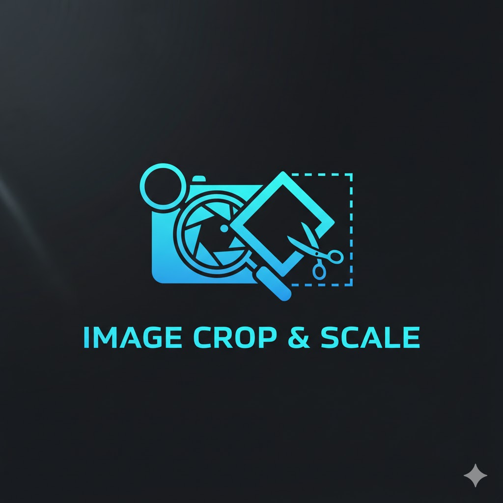

# Image Crop & Scale

A powerful image cropping and scaling tool designed for game developers and digital artists. Automatically calculates platform-specific dimensions and provides precise control over image processing for multiple platforms and custom requirements.

## Features

- **Platform-Specific Modes**: Predefined dimensions for Unity Publisher Portal, Steam Store, Epic Games Store, App Store & Play Store, and Social Media
- **Global Strategy Options**: Crop to Fill or Scale to Fit modes
- **Custom Dimensions**: Create custom image sizes for specific needs
- **Focus Center Control**: Adjust the crop focus point for optimal composition
- **Padding Background**: Set background color for padding when scaling
- **Real-time Preview**: See changes instantly as you adjust parameters
- **Responsive Design**: Works on desktop and mobile devices
- **Batch Download**: Download all processed images at once in a ZIP file
- **Multiple Image Formats**: Save individual images as PNG files

## How It Works

1. **Upload Image**: Click the "Upload Master" button to select an image
2. **Select Platform Mode**: Choose from predefined platform dimensions or select "Custom Dimensions" for your own specifications
3. **Choose Global Strategy**: 
   - **Crop to Fill**: Crops the image to fill the target dimensions (may cut parts of the image)
   - **Scale to Fit**: Scales the image to fit within the target dimensions (may leave padding)
4. **Adjust Custom Dimensions**: If using custom mode, set your desired width and height
5. **Set Focus Center**: Adjust the crop focus point using the "🎯 Reset Focus Center" button
6. **Configure Padding**: Choose a background color for padding when using "Scale to Fit"
7. **Preview and Download**: See the result and download your processed image

## Platform Dimensions

### Unity Publisher Portal
- Cover: 1950×1300
- Social: 1200×630
- Card: 420×280
- Icon: 160×160

### Steam Store
- Main: 616×353
- Header: 460×215
- Small: 231×87
- Hero: 1920×620

### Epic Games Store
- Landscape: 2560×1440
- Portrait: 1200×1600
- Thumb: 400×400

### App Store & Play Store
- Icon: 1024×1024
- Feature: 1024×500
- Screen: 1242×2208

### Social Media
- YouTube Thumbnail: 1280×720
- X Header: 1500×500
- Instagram Post: 1080×1080

## Usage Instructions

1. **Upload Image**: Click the "Upload Master" button to select an image
2. **Select Mode**: Choose your platform or custom dimensions
3. **Adjust Settings**: Modify the global strategy, focus center, and padding as needed
4. **Preview**: See the processed image in real-time
5. **Download**: Click "💾 PNG" to download individual images or "📦 Download All (.zip)" to download all processed images at once

## Controls

- **Platform Mode Selector**: Choose predefined platform dimensions
- **Global Strategy**: Toggle between Crop to Fill and Scale to Fit
- **Padding Background**: Select background color for padding
- **Reset Focus Center**: Reset the crop focus point to center
- **Custom Size Inputs**: Set custom width and height
- **Download Button**: Save the processed image
- **Theme Toggle**: Switch between dark, light, and inferno themes

## Technical Details

This tool is built with pure HTML, CSS, and JavaScript with no external dependencies except for JSZip for batch downloading. It uses the HTML5 Canvas API for image processing and manipulation.

### Image Processing Methods

- **Crop to Fill (Cover)**: Maintains aspect ratio by cropping the image to fill the target dimensions
- **Scale to Fit (Contain)**: Maintains aspect ratio by scaling the image to fit within the target dimensions

### Focus Point Adjustment

The focus point can be adjusted by clicking on the preview canvas when using the Crop to Fill strategy. This allows for precise control over which part of the image is preserved during cropping.

### Custom Dimensions

Users can add custom image sizes by entering width and height values and clicking the "+ Add Crop" button. Custom crops can be removed using the trash icon.

## Browser Compatibility

This tool works in all modern browsers including:
- Chrome 80+
- Firefox 70+
- Safari 13+
- Edge 80+

## License

This project is licensed under the MIT License - see the LICENSE file for details.

## Author

Created by URageTools

## Contributing

Contributions are welcome! Please feel free to submit a Pull Request.

## Support

For support or questions, please open an issue on the GitHub repository.

## Browser Compatibility

This tool works in all modern browsers that support:
- File API for image uploads
- Canvas API for image processing
- Modern JavaScript features

## License

This tool is part of the URageTools collection and is provided as-is for educational and creative purposes.