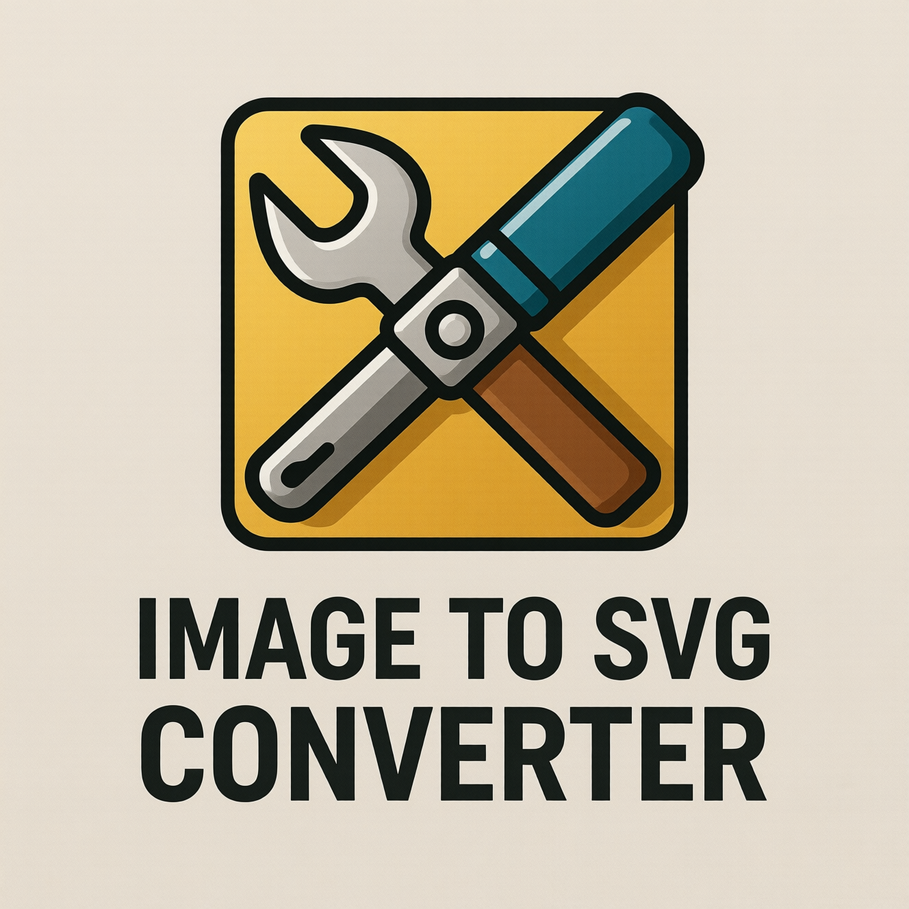

# Image to SVG Converter

A powerful, client-side tool for converting raster images to scalable vector graphics (SVG) directly in your browser. This tool uses the ImageTracer.js library to transform pixel-based images into clean, editable SVG vector graphics without any server processing.

## Features

- **Client-Side Processing**: All conversion happens in your browser - no server uploads required
- **Real-time Preview**: See the SVG output as you adjust conversion parameters
- **Customizable Settings**: Control smoothness and color count for optimal results
- **Quick Presets**: Predefined settings for different use cases (balanced, 2-color logo, super smooth)
- **Direct Download**: Save your converted SVG files with one click
- **Responsive Design**: Works on desktop and mobile devices
- **No Image Loss**: SVG files maintain quality at any size

## How to Use

1. **Upload an Image**: Drag and drop an image file (PNG or JPEG) onto the drop zone, or click to select a file
2. **Adjust Settings**: Modify the smoothness and color count sliders to fine-tune the conversion
3. **Preview Results**: See both the original image and the converted SVG side-by-side
4. **Download SVG**: Click the "Download SVG File" button to save your vector graphic

### Quick Presets

- **Balanced**: Default settings for good quality vectorization
- **2-Color Logo**: Optimized for simple logos with limited colors
- **Super Smooth**: Creates smooth curves for photographic images

## Technical Details

This tool utilizes the [ImageTracer.js](https://github.com/jankovicsandras/imagetracerjs) library, a JavaScript implementation for converting raster images to SVG vector graphics. The conversion process:

1. Analyzes the input image pixel by pixel
2. Identifies color regions and edges
3. Creates SVG paths that represent the image structure
4. Optimizes the SVG output for clean, efficient vector graphics

### Conversion Parameters

- **Smoothness**: Controls how much the vector paths follow the original image edges (0.1-5.0)
- **Colors**: Sets the maximum number of colors in the output SVG (2-64)

## Browser Compatibility

This tool works in all modern browsers that support:

- HTML5 Canvas API
- File API
- JavaScript ES5+ features

### Supported Browsers

- Chrome 40+
- Firefox 35+
- Safari 8+
- Edge 12+
- Internet Explorer 11+ (limited support)

## License

This project is released under the [Unlicense](LICENSE), which is a public domain dedication. You can use, modify, and distribute this tool freely for any purpose.

The underlying ImageTracer.js library is also released under the Unlicense.

## Author

This tool was created as part of the URageTools collection, a suite of web-based utilities for creative and development tasks.

## Acknowledgements

- [ImageTracer.js](https://github.com/jankovicsandras/imagetracerjs) - The core library used for image tracing
- [FontAwesome](https://fontawesome.com/) - Icons used in the interface