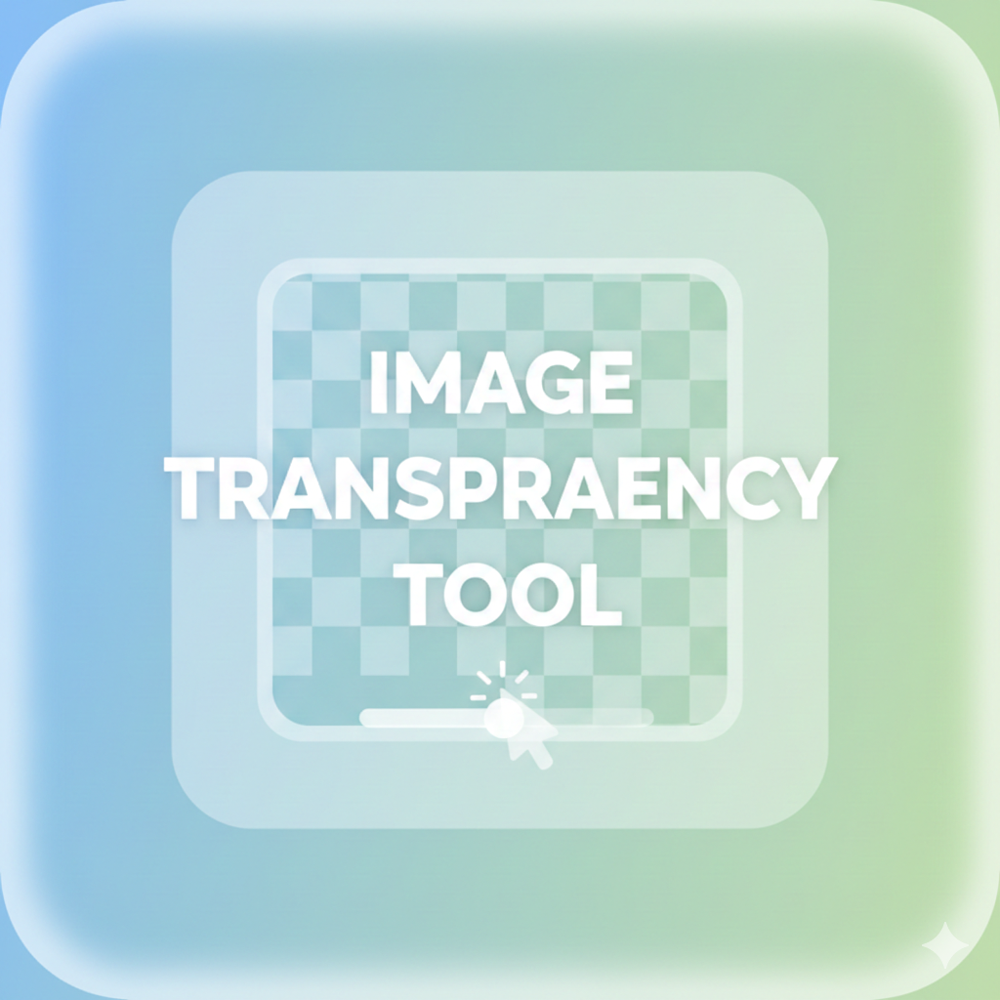

# Image Transparency Tool

A simple and intuitive web-based tool for adjusting image transparency and downloading transparent PNG files.

## Features

- **Image Upload**: Upload any image file (JPG, PNG, etc.) using file browser or drag-and-drop
- **Opacity Control**: Adjust image transparency using a slider from 0% (fully transparent) to 100% (fully opaque)
- **Real-time Preview**: See transparency changes instantly as you adjust the slider
- **Download Functionality**: Save your transparent image as a PNG file
- **Modern UI**: Sleek dark theme with glassmorphism design elements
- **Responsive Design**: Works on desktop and mobile devices

## How to Use

1. **Upload an Image**: Click the "📁 Choose an Image or Drag & Drop" area or drag and drop an image file onto the upload zone
2. **Adjust Transparency**: Use the slider to control the opacity level (0% to 100%)
3. **Preview Changes**: See the transparency effect in real-time on the canvas
4. **Download Result**: Click the "Download PNG" button to save your transparent image

## Technical Details

This tool uses the HTML5 Canvas API to manipulate image transparency:

- **Image Processing**: Images are loaded into a canvas element for manipulation
- **Transparency Control**: Uses `ctx.globalAlpha` to adjust image opacity
- **Export Functionality**: Converts the canvas to a PNG using `canvas.toDataURL('image/png')`
- **File Handling**: Utilizes `FileReader` API for reading uploaded images
- **Responsive Design**: CSS Flexbox and modern layout techniques for responsive UI

## Browser Compatibility

- Chrome 40+
- Firefox 3.6+
- Safari 5+
- Edge 12+
- Opera 27+

The tool works in all modern browsers that support HTML5 Canvas and the File API.

## License

This project is licensed under the MIT License - see the [LICENSE](../../LICENSE) file for details.

## Author

**URageTools** - A collection of useful web-based tools for developers and designers

For more information about this tool or other tools in the URageTools collection, visit the [main repository](../../README.md).

## Acknowledgments

- Built with HTML5 Canvas API
- Modern CSS techniques including flexbox and glassmorphism design
- Responsive design principles