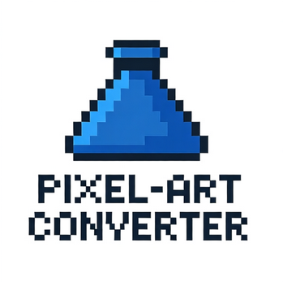

# Pixel Art Converter

A web-based tool for converting images into pixel art with customizable settings and high-quality output.

## Features

- **Image Upload**: Easily upload any image file (JPG, PNG, GIF, etc.)
- **Pixel Density Control**: Adjust pixel size from 1px to 32px for different retro effects
- **Auto-Scaling**: Automatically scales pixel density for large images to maintain quality
- **Background Removal**: Remove selected background colors to create transparent pixel art
- **Color Sampling**: Use the eye-dropper tool to sample colors from your source image
- **High-Resolution Export**: Save both standard and 4K scaled versions of your pixel art
- **Theme Switching**: Choose between dark, light, and inferno themes for comfortable use

## How to Use

1. **Upload an Image**: Click "Select Image" to choose an image from your device
2. **Adjust Settings**:
   - Use the pixel density slider to control the size of pixels (1-32px)
   - Enable "Auto-scale" for large images to maintain quality
   - Use "Auto-convert" to automatically convert as you adjust settings
   - Select a background color using the color picker
   - Enable "Remove selected color" to make background transparent
3. **Convert**: Click "✨ Process Pixels" to convert your image to pixel art
4. **Download**: Save your pixel art using the "💾 Save PNG" or "🖼️ Save 4K Scale" buttons

## Technical Details

This tool uses HTML5 Canvas API for image processing and manipulation. The conversion algorithm:

- Analyzes each pixel block to determine the dominant color
- Applies nearest-neighbor scaling for crisp pixelation
- Supports transparency removal with color matching
- Uses a checkerboard pattern background for better visibility of transparent areas
- Implements image scaling with `imageSmoothingEnabled=false` for sharp pixel output

## Browser Compatibility

- Chrome 60+
- Firefox 55+
- Safari 10+
- Edge 16+
- Opera 47+

## License

This project is licensed under the MIT License - see the [LICENSE](../LICENSE) file for details.

## Author

URageTools - A collection of web-based creative tools for artists and developers

For more information about this tool or other projects in the URageTools collection, visit the [main repository](../README.md).