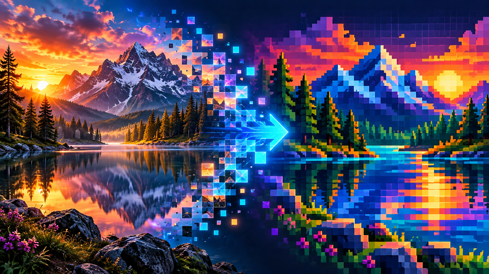

# Pixel Art Converter

A web-based tool for converting images into pixel art with customizable settings and high-quality output.

## Features

- **Image Upload**: Easily upload any image file (JPG, PNG, GIF, etc.)
- **Pixel Density Control**: Adjust pixel size from 1px to 32px for different retro effects
- **Block Size Control**: Merge larger blocks by replacing each block with its most common color
- **Tolerance + Inset**: Tune dominant-color grouping (color tolerance) and ignore block edges (block inset) for cleaner results
- **Fast Preview + Export Quality**: Render a scaled-down preview for speed, then export from preview or re-render from the original image
- **AI Cleanup Tools**: Gradient crush, anti-alias removal, despeckle, dither cleanup, outline, and tiny-island removal
- **Merge Similar Regions**: Flood-fill merge connected pixels within a color threshold into a single representative color
- **Palette + Indexed Export**: Quantize/snap to a palette, export palette files, and export indexed PNG
- **Palette Presets**: Snap to classic palettes like PICO-8, Game Boy, DawnBringer 16, and C64
- **Grid Detection + Offsets**: Auto-detect pixel grid alignment and fine-tune X/Y offsets
- **Pre-Resize (Grid Drift Fix)**: Slightly resample the input (e.g. 99% or 101%) to correct global pixel-grid drift in AI pixel art
- **Sprite Sheet Mode**: Apply the same cleanup per cell to avoid cross-sprite bleeding
- **Auto-Scaling**: Automatically scales pixel density for large images to maintain quality
- **Background Removal**: Remove selected background colors to create transparent pixel art
- **Transparency Preservation**: Keep mostly-transparent blocks transparent to avoid bleeding into empty space
- **Alpha-Weighted Edge Sampling**: Semi-transparent edge pixels contribute less than solid sprite pixels, which helps prevent white fringe blocks around transparent sprites
- **Edge Color Bleed Fix**: Semi-transparent edge pixels inherit nearby solid sprite color before block sampling, reducing matte halos around transparent cutouts
- **Color Sampling**: Use the eye-dropper tool to sample colors from your source image
- **High-Resolution Export**: Save both standard and 4K scaled versions of your pixel art
- **Theme Switching**: Choose between dark, light, and inferno themes for comfortable use
- **Quick Presets**: One-click starting points for common AI pixel-art cleanup workflows
- **AI to Real Pixels Profile**: Normalizes fake AI pixel-art renders to a true low-resolution grid, snaps near-duplicate colors, removes fake anti-aliasing, and exports the target-size pixel image
- **Structured Sidebar**: Controls are grouped by Source, Conversion Profile, Pixel Grid, Block Sampling, Palette, AI Cleanup, Transparency, Sprite Sheet, and Preview/Export instead of numbered steps

## How to Use

Start by loading an image from disk or from a dashboard image pool. For AI-generated fake pixel art, choose **AI to Real Pixels** under Conversion Profile and apply it before tuning details. This profile is designed to collapse soft, high-resolution "pixel style" renders into an actual low-resolution pixel grid.

Use **Pixel Grid** and **Block Sampling** for the core conversion shape, then use **Palette** and **AI Cleanup** to remove near-duplicate colors, gradients, fake anti-aliasing, dithering noise, and tiny islands. Use **Preview & Export** to decide whether the saved PNG should stay at the true target pixel size or be upscaled with nearest-neighbor scaling.

Click **Process Pixels** when auto-convert is disabled, then save the result with **Save PNG**, **Save All PNGs**, **Save GIF**, **Save Frames**, or **Save 4K Scale** depending on the loaded source.

## Technical Details

This tool uses HTML5 Canvas API for image processing and manipulation. The conversion algorithm:

- Analyzes each pixel block to determine the dominant color
- Applies nearest-neighbor scaling for crisp pixelation
- Supports transparency removal with color matching
- Uses a checkerboard pattern background for better visibility of transparent areas
- Implements image scaling with `imageSmoothingEnabled=false` for sharp pixel output
- The AI to Real Pixels profile intentionally exports the normalized target canvas so the result is real pixel data, not a softened high-resolution image with a pixel-art look
- Keeps the in-tool preview canvases contained within their preview cards
- Supports first-run Studio quick-convert without manually opening the Pixel Art tool first

## Browser Compatibility

- Chrome 60+
- Firefox 55+
- Safari 10+
- Edge 16+
- Opera 47+

## License

This project is licensed under the MIT License - see the [LICENSE](../LICENSE) file for details.

## Author

URageTools - A collection of web-based creative tools for artists and developers

For more information about this tool or other projects in the URageTools collection, visit the [main repository](../README.md).
