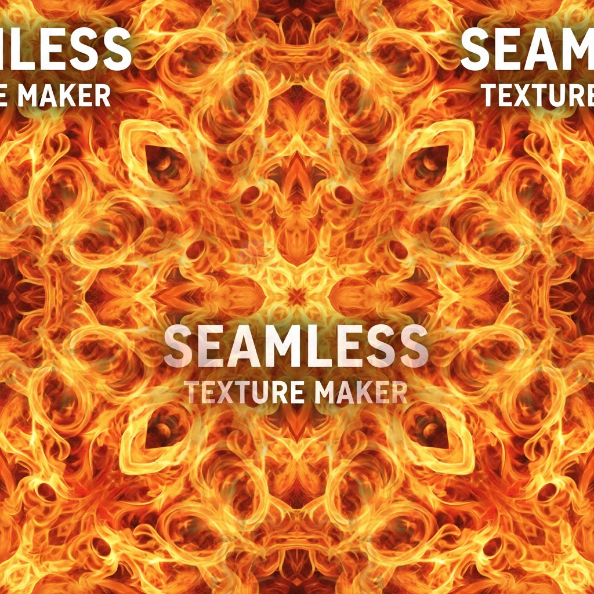

# Seamless Texture Maker

Create professional, tiling seamless textures for 3D models, web designs, and more with this powerful online tool.

## Features

- **Multiple Edge Mask Types**: Choose between Linear (soft/blurry), Noise (organic/grainy), or Pure Mirror (kaleidoscope) edge masking
- **Adjustable Suture Depth**: Control how much of the texture is blended at the edges (0-400px)
- **Color Jitter Control**: Add subtle color variations to create more natural-looking textures (0-100%)
- **3D Tiling Scale**: Adjust the tiling scale for different texture sizes (1x1 to 10x10)
- **Real-time 3D Preview**: Visualize how your texture will look on different 3D shapes (sphere, box, plane)
- **Cross-platform Compatibility**: Works in any modern web browser
- **Instant Download**: Export your seamless textures with a single click

## How to Use

1. **Upload an Image**: Click "Choose File" to upload your source texture image
2. **Select Edge Mask Type**: Choose from three different edge masking techniques:
   - Linear: Creates soft, blurred edges
   - Noise: Generates organic, grainy transitions
   - Mirror: Creates kaleidoscope-like patterns
3. **Adjust Suture Depth**: Use the slider to control how much of the texture is blended at the edges
4. **Apply Color Jitter**: Add subtle color variations to make your texture more natural
5. **Set Tiling Scale**: Adjust the scale of the texture tiling pattern
6. **Preview in 3D**: See how your texture looks on different 3D shapes in real-time
7. **Download**: Click the "DOWNLOAD SEAMLESS MAP" button to save your seamless texture

## Technical Details

This tool uses advanced image processing techniques to create seamless textures:

- **Quad Stitching Algorithm**: Divides the source image into four quadrants and stitches them together
- **Edge Masking**: Applies different masking techniques to blend edges seamlessly
- **3D Rendering**: Uses Three.js for real-time 3D preview of textures on various shapes
- **Canvas API**: Leverages HTML5 Canvas for image manipulation and processing
- **Responsive Design**: Adapts to different screen sizes and resolutions

## Browser Compatibility

- Chrome 60+
- Firefox 55+
- Safari 10+
- Edge 16+
- Opera 47+

## License

This project is licensed under the MIT License - see the [LICENSE](../LICENSE) file for details.

## Author

**URage Tools** - A collection of web-based creative tools for artists and developers

For more information about URage Tools, visit [https://tools.urage.net](https://tools.urage.net)

## Acknowledgments

- Built with [Three.js](https://threejs.org/) for 3D rendering
- Inspired by professional texture creation workflows