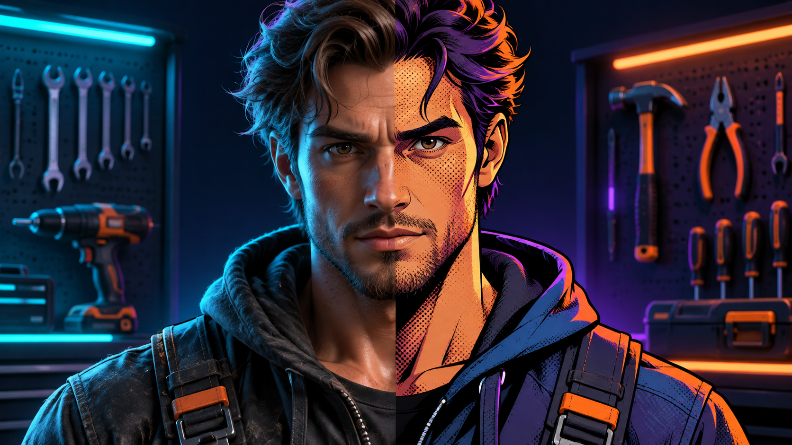

# Toon Image Shader

A browser-based image processing tool that converts photos and images into cel-shaded, comic-style toon art with customizable parameters. Uses HTML5 Canvas API for local, real-time processing — no server uploads required.

## Features

- **Cel Bands Control**: Adjust the number of color levels (2–14) from flat cartoon look to detailed shading
- **Ink Outline**: Add bold comic-style outlines around image edges with adjustable width and intensity
- **Style Presets**: Four built-in presets — Soft Anime, Comic Ink, Flat Cel, Manga Mono
- **Color Controls**: Saturation boost, contrast adjustment, and tone modes (Full color, Warm anime, Cool comic, Manga mono)
- **Shadow Shaping**: Control how shadows blend and render in the toon effect
- **Edge Detail**: Fine-tune edge detection sensitivity for cleaner or more detailed outlines
- **Rim Light**: Add glowing edge highlights for anime-style rim lighting effects
- **Paper Grain / Halftone**: Add texture overlays including dither patterns, halftone dots, and paper grain
- **Custom Colors**: Set custom ink color and rim light color using the built-in color picker
- **Split View**: Compare original vs. processed image side by side
- **Transparent Background**: Export with transparency for use in games or designs
- **Local Processing**: All image processing happens in your browser — no data is uploaded anywhere

## How to Use

1. **Load an Image**: Drag and drop an image file (PNG, JPG, WebP, GIF) onto the drop zone, or click to browse files
2. **Choose a Preset**: Select one of the four style presets for quick results
3. **Adjust Parameters**: Fine-tune cel bands, ink outline, smoothing, saturation, contrast, and more using the sidebar controls
4. **Preview**: Watch changes in real-time on the canvas preview area
5. **Export**: Click "Export PNG" to download your processed image

## Controls

| Control | Description | Default | Range |
|---------|-------------|---------|-------|
| Cel bands | Number of color quantization levels | 10 | 2–14 |
| Ink outline | Outline intensity/strength | 54 | 0–100 |
| Ink width | Stroke thickness for outlines | 1 | 1–6 |
| Paint smoothing | Blur radius before processing | 3 | 0–8 |
| Color boost | Saturation multiplier | 161% | 0–220% |
| Contrast | Contrast adjustment | +12% | -60% to +100% |
| Shadow shape | Shadow blending intensity | 30% | 0–100% |
| Edge detail | Edge detection sensitivity | 55% | 0–100% |
| Rim light | Rim highlight intensity | 18% | 0–100% |
| Paper grain | Texture/noise overlay amount | 8% | 0–100% |

## Technical Details

This tool uses the HTML5 Canvas API for pixel-level image manipulation. The processing pipeline:

1. Smooths the source image using a box blur based on the smoothing parameter
2. Computes luminance values for each pixel
3. Detects edges using horizontal and vertical gradient analysis
4. Quantizes colors into discrete cel bands
5. Applies tone mapping (color/warm/cool/mono)
6. Renders ink outlines by thresholding edge maps
7. Adds optional effects: dithering, halftone patterns, paper grain, rim lighting

## Browser Compatibility

- Chrome 60+
- Firefox 55+
- Safari 10+
- Edge 16+
- Opera 47+

## License

This project is licensed under the MIT License — see the [LICENSE](../LICENSE) file for details.

## Author

URageTools — A collection of web-based creative tools for artists and developers

For more information about this tool or other projects in the URageTools collection, visit the [main repository](../../README.md).