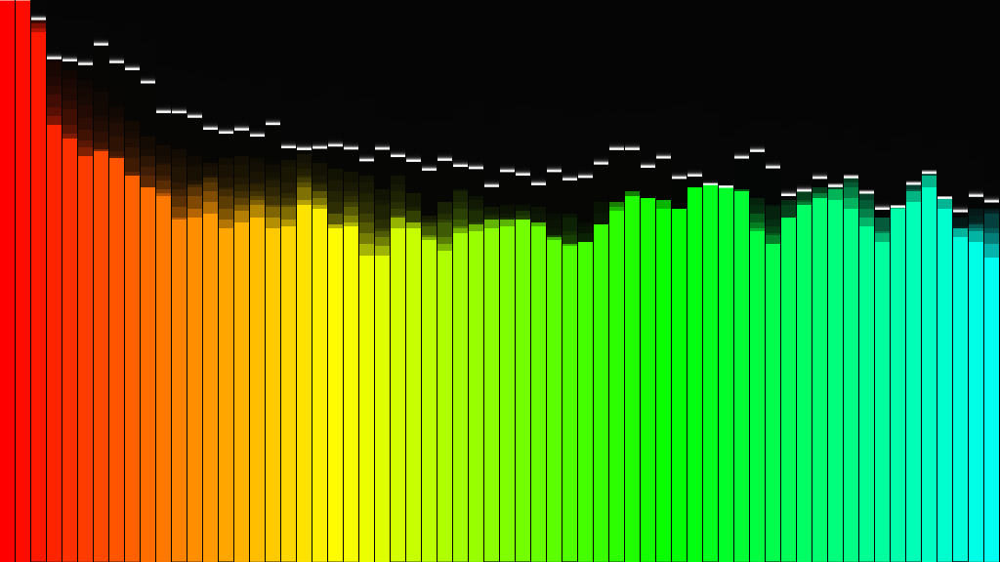

# URage Pulse - Multi-View Music Visualizer



A retro-inspired, interactive music visualizer with multiple visualization modes and customizable display options. Built with vanilla JavaScript and the Web Audio API.

## Features

### 🎨 Multiple Visualization Modes

- **Bars** - Classic frequency spectrum with falling peaks for dynamic effect
- **Circular** - Radial visualization with bars extending from the center point
- **Waveform** - Smooth waveform display with mirrored bottom fill
- **Spectrum** - Gradient-filled frequency bars with smooth transitions
- **Orbs** - Animated glowing orbs that pulse and float with the music

### 🌈 Color Modes

- **Spectrum** - Full rainbow colors based on frequency distribution
- **Mono Green** - Classic matrix-style green monochrome (retro)
- **Mono Cyan** - Cool cyan/teal monochrome aesthetic
- **Gradient** - Smooth gradient from cool blue to warm orange

### ⚙️ Customization Options

- **Pixel Size Selection** - Choose your retro pixel density:
  - 16-Bit (Smooth) - High resolution, smooth rendering
  - 8-Bit (Chunky) - Medium resolution, classic 8-bit look
  - 4-Bit (Extreme) - Low resolution, extreme pixelated effect

## How to Use

1. **Load Audio**: Click the "Load Track" button to select an audio file from your device
2. **Select View**: Choose your preferred visualization mode from the "View Type" dropdown
3. **Pick Colors**: Select a color mode that matches your vibe
4. **Adjust Pixel Size**: Fine-tune the pixelation level for your desired aesthetic
5. **Enjoy**: Watch the visualizer respond to your music in real-time

## Supported Audio Formats

The visualizer supports all audio formats that your browser can decode, including:
- MP3
- WAV
- OGG
- FLAC
- AAC
- And more depending on browser support

## Visualization Details

### Bars
Traditional frequency spectrum visualization with individual bars for each frequency band. Features falling peak markers that decay over time for a classic retro look.

### Circular
Transforms the frequency data into a circular display, with bars radiating outward from the center. Great for a more artistic, symmetrical view of the audio spectrum.

### Waveform
Displays the frequency data as a continuous waveform line with a mirrored fill below. Creates a smooth, flowing visualization of the overall audio shape.

### Spectrum
Uses gradient fills on frequency bars to create a smooth visual progression. Each bar smoothly transitions in color and intensity for a modern look.

### Orbs
Features animated glowing orbs that pulse and float with the music. Each orb responds to a different frequency range, creating an organic, bubble-like effect.

## Technical Details

- **Web Audio API**: Uses the Web Audio API's AnalyserNode for real-time frequency analysis
- **Canvas Rendering**: All visualizations rendered using HTML5 Canvas 2D context
- **FFT Size**: 256-point Fast Fourier Transform for balanced detail and performance
- **Frame Rate**: Optimized animation loop using requestAnimationFrame
- **Responsive**: Adapts to different screen sizes while maintaining aspect ratio

## Browser Compatibility

- Chrome/Chromium (all modern versions)
- Firefox (all modern versions)
- Safari (iOS 14.5+, macOS)
- Edge (all modern versions)

Note: Requires support for Web Audio API and Canvas 2D

## Tips & Tricks

- **Best Results**: Use clear, dynamic music with distinct frequency ranges
- **Performance**: If experiencing lag, reduce pixel size to a higher value (4-Bit)
- **Smooth Transitions**: Try switching visualization modes while music is playing
- **Color Combinations**: Different color modes work better with different music genres
- **Fullscreen**: Maximize your browser window for the best visual experience

## Project Structure

```
music-visualizer/
├── index.html          # Main visualizer application
├── README.md          # This file
└── thumbnail.png      # Preview image
```

## Credits

Built as part of the URageTools collection - a suite of creative development tools.

Enjoy the visual experience! 🎵✨
