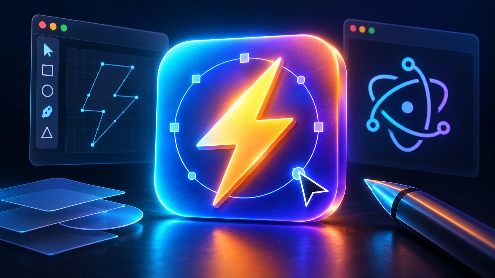

# Electron App Icon Generator

Easily generate icon files for your Electron applications from a single source image.

## Features
- **Automatic Resizing**: Generates all required icon sizes.
- **Format Support**: Create .ico (Windows) and .icns (macOS) compatible assets.
- **Preview**: See how your icon looks at different sizes.

## Usage
1. Upload your source image (preferably 1024x1024 png).
2. Select the output formats you need.
3. Download the generated assets.
