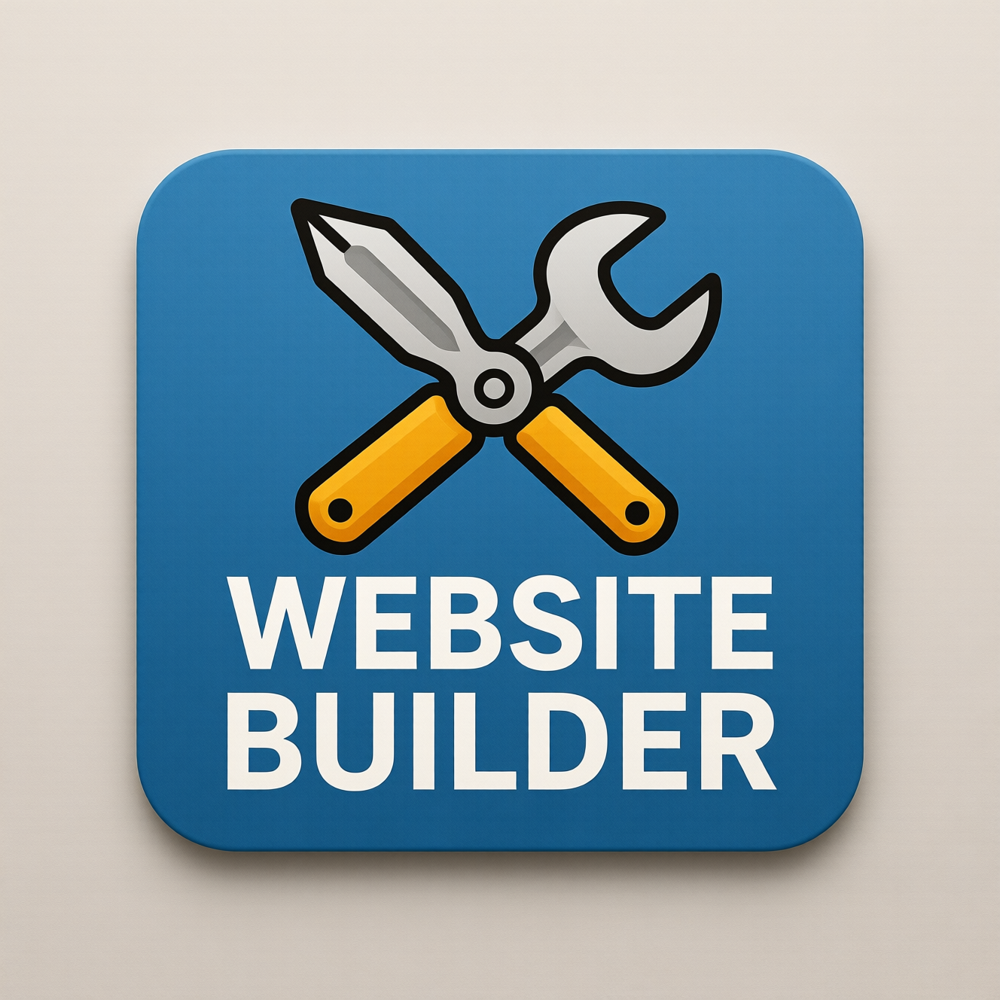

# Website Builder

This tool provides a simple interface for building basic websites. It allows you to create and customize web pages without needing to write code.

## Features

- Drag and drop interface for building pages
- Pre-designed templates
- Customizable components
- Responsive design
- Export functionality to create complete websites

## How to Use

1. Select a template or start with a blank page
2. Drag and drop components to build your page
3. Customize the content and styling
4. Preview your website in real-time
5. Export your complete website when finished

## Technical Details

- Client-side web application
- Responsive design that works on mobile and desktop
- No server-side processing required
- Uses modern web technologies
- Export functionality for complete websites