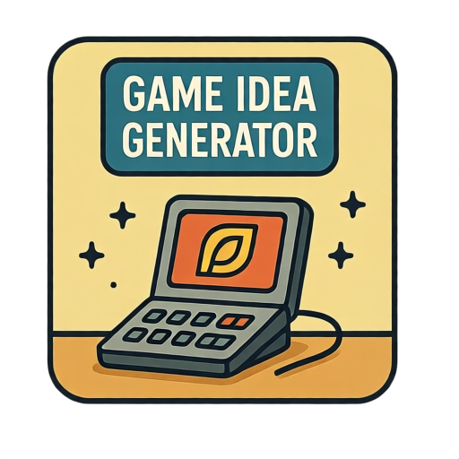

# Game Idea Generator

This tool helps generate creative game ideas and concepts. It's perfect for game developers, designers, or anyone looking for inspiration for their next project.

## Features

- Generate random game ideas with different themes
- Customize parameters like genre, platform, and complexity
- Save and organize your favorite ideas
- Export ideas for further development
- Responsive design for various screen sizes

## How to Use

1. Select your preferred game parameters (genre, platform, etc.)
2. Click "Generate Idea" to get a new concept
3. Save ideas you like for later
4. Modify parameters to get different results
5. Export your favorite ideas for development

## Technical Details

- Client-side processing (no server required)
- Responsive design that works on mobile and desktop
- No external dependencies required
- Random generation algorithm for creative ideas